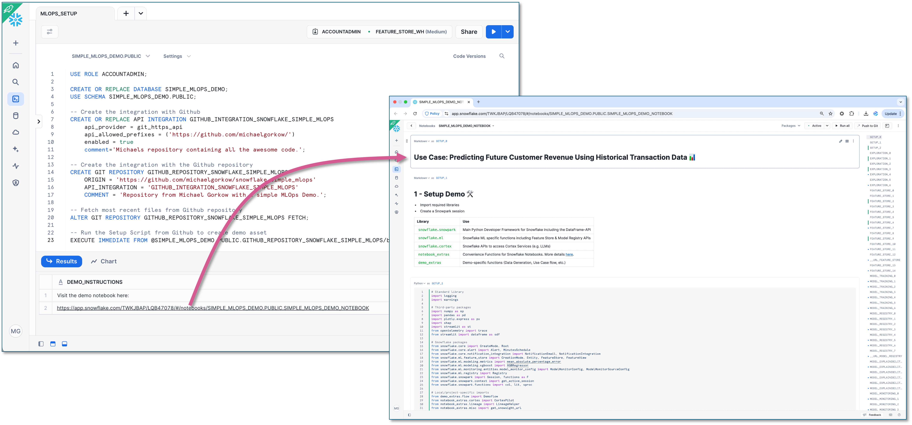

# Simple MLOps in Snowflake
This repo demonstrates a complete MLOps pipeline on Snowflake using Python, Snowpark, Snowflake ML, Cortex, and other native services. It walks through a real-world inspired use case:  
**Predicting Future Customer Revenue from Historical Transaction Data.**

## What you'll learn
* Data exploration and preparation using Snowpark Dataframes and LLMs
* Feature engineering with Snowpark
* Using the Snowflake Feature Store
* Model training using XGBoost
* Model evaluation and interpretability with SHAP
* Using the Snowflake Model Registry
* Model monitoring and alerting

## Get Started
If you don't have a Snowflake account, register for a free Snowflake Trial Account:
- [Free Snowflake Trial Account](https://signup.snowflake.com/)

> [!IMPORTANT]
> Some features like the Feature Store require Snowflake Enterprise Edition or higher. Availability of specific Cortex LLM models can be found [here](https://docs.snowflake.com/en/user-guide/snowflake-cortex/llm-functions#availability).

Integrate this Github Repository with Snowflake by running the following SQL code in a Snowflake Worksheet:
```sql
USE ROLE ACCOUNTADMIN;

CREATE OR REPLACE DATABASE SIMPLE_MLOPS_DEMO;
USE SCHEMA SIMPLE_MLOPS_DEMO.PUBLIC;

-- Create the integration with Github
CREATE OR REPLACE API INTEGRATION GITHUB_INTEGRATION_SNOWFLAKE_SIMPLE_MLOPS
    api_provider = git_https_api
    api_allowed_prefixes = ('https://github.com/michaelgorkow/')
    enabled = true
    comment='Michaels repository containing all the awesome code.';

-- Create the integration with the Github repository
CREATE GIT REPOSITORY GITHUB_REPOSITORY_SNOWFLAKE_SIMPLE_MLOPS
	ORIGIN = 'https://github.com/michaelgorkow/snowflake_simple_mlops' 
	API_INTEGRATION = 'GITHUB_INTEGRATION_SNOWFLAKE_SIMPLE_MLOPS' 
	COMMENT = 'Repository from Michael Gorkow with a simple MLOps Demo.';

-- Fetch most recent files from Github repository
ALTER GIT REPOSITORY GITHUB_REPOSITORY_SNOWFLAKE_SIMPLE_MLOPS FETCH;

-- Run the Setup Script
EXECUTE IMMEDIATE FROM @SIMPLE_MLOPS_DEMO.PUBLIC.GITHUB_REPOSITORY_SNOWFLAKE_SIMPLE_MLOPS/branches/main/_internal/setup.sql;
```

Once the demo setup finishes, click the provided link to open the notebook and explore the demo:  


## Snowflake Features in this demo
* [Snowflake's Git Integration](https://docs.snowflake.com/en/developer-guide/git/git-overview)
* [Snowpark](https://docs.snowflake.com/en/developer-guide/snowpark/python/index)
* [Snowpark ML](https://docs.snowflake.com/en/developer-guide/snowpark-ml/overview)
* [Snowflake Feature Store](https://docs.snowflake.com/en/developer-guide/snowpark-ml/feature-store/overview)
* [Snowflake Model Registry](https://docs.snowflake.com/en/developer-guide/snowpark-ml/model-registry/overview)
* [Snowflake Cortex](https://docs.snowflake.com/en/user-guide/snowflake-cortex/llm-functions)
* [Snowflake Alerts](https://docs.snowflake.com/en/user-guide/alerts)

## API Documentation
* [Snowpark API](https://docs.snowflake.com/developer-guide/snowpark/reference/python/latest/snowpark/index)
* [Snowpark ML API](https://docs.snowflake.com/en/developer-guide/snowpark-ml/reference/latest/index)
* [Snowflake Feature Store API](https://docs.snowflake.com/en/developer-guide/snowpark-ml/reference/latest/feature_store)
* [Snowflake Model Registry API](https://docs.snowflake.com/en/developer-guide/snowpark-ml/reference/latest/registry)
* [Snowflake Python API](https://docs.snowflake.com/en/developer-guide/snowflake-python-api/reference/latest/index)